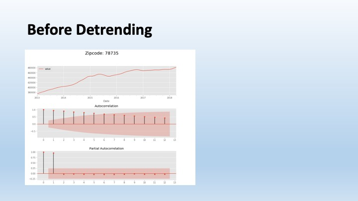
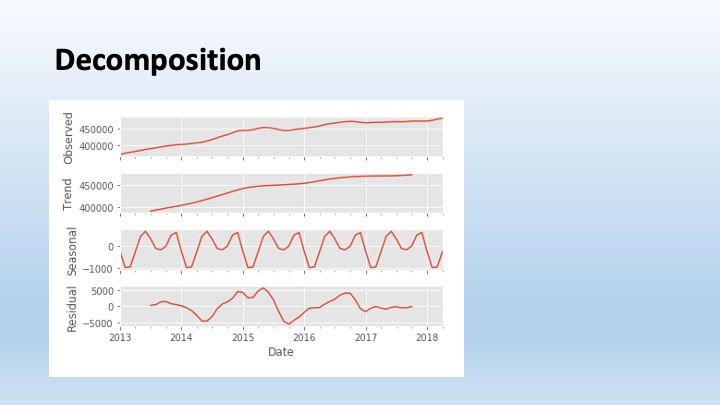
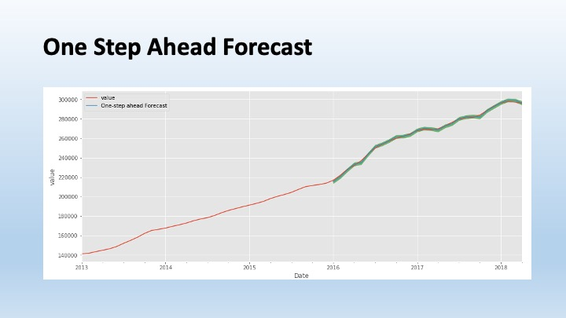
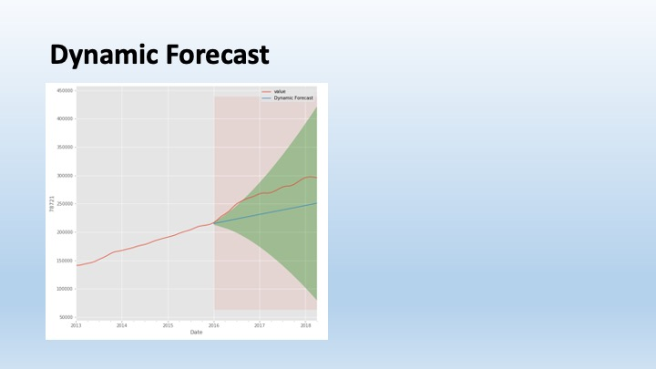
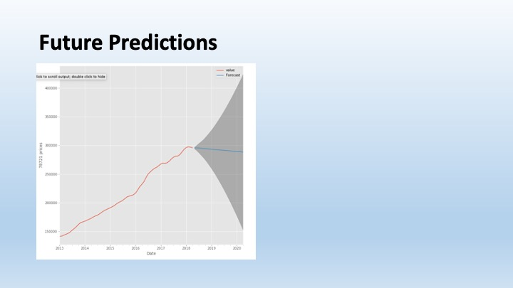
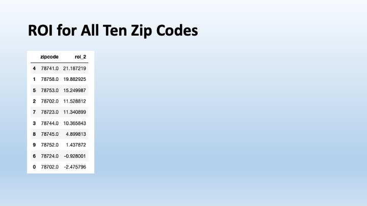

# House Prices Time Series

## Introduction

This project was to build a model to identify the five best zip codes in Austin, TX for investing in residential real estate.

## The Dataset

US home sales from 4/1996-4/2018 from Zillow.com. The dataset was narrowed to the 42 zip codes in the Austin, TX area.

To eliminate the effect of the 2008 housing crisis and focus on the recent upward trend in the Austin area, the dataset was further narrowed to 2013-2018.

The ten zip codes showing the greatest gain in home prices during that time were modeled.

## The Model

The data for each zip code were detrended to remove autocorrelation and then modeled with ARIMA to predict sale prices for the next two years.

## Conclusion

The current model does not use a seasonality component due to the limited number of years we are focusing on.

The next step will be to rerun the model with data from more years using the seasonality component to improve predictions, which may change the recommended zip codes.
